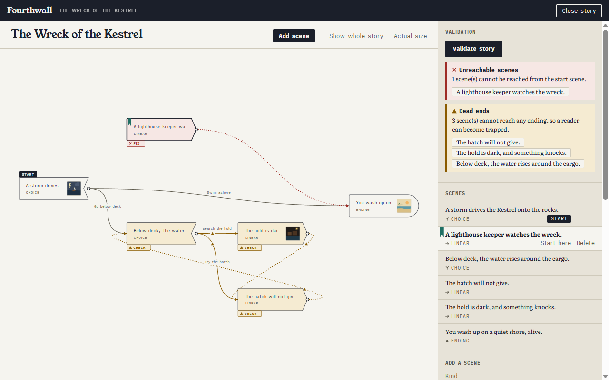
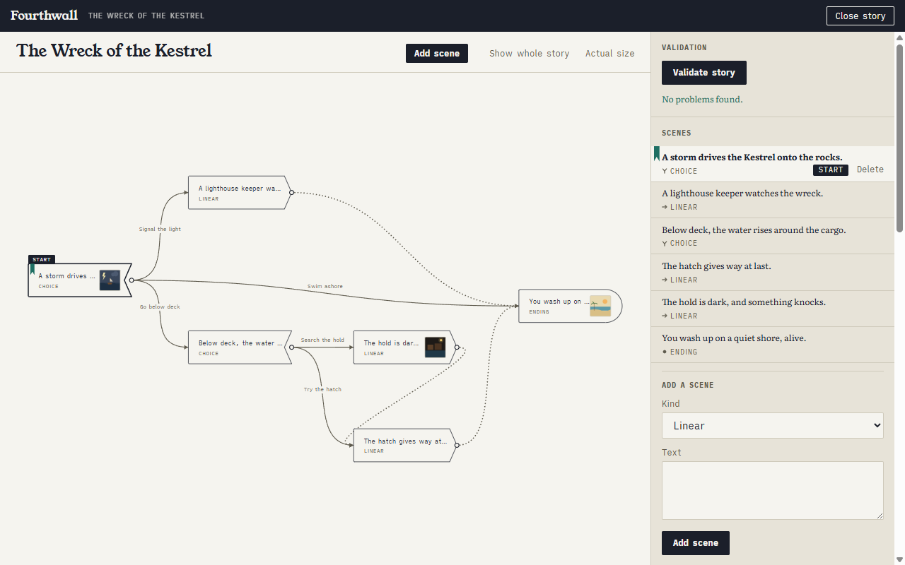

# fourthwall

A text-based RPG in the tradition of write-your-own-adventure gamebooks: every choice branches, every branch has consequences, and the whole story is a directed graph of scenes — rooms and doors, decisions and outcomes, one path leading to another.

This repository currently hosts the **story creation tool**: a visual editor where creators design, visualize, and validate branching stories before a player ever sees them.

## What the tool does

- **Design** — author scenes (narrative text plus an image each) and wire choices between them on an interactive graph canvas. Scenes are Choice (2+ paths out), Linear (one follow-up), or Ending (death, victory, or otherwise — the story stops here).
- **Visualize** — the story *is* a graph: pan, zoom, drag nodes, see every branch and every loop at a glance.
- **Validate** — structural checks: exactly one start scene, no unreachable scenes, no accidental dead ends, at least one reachable ending, inescapable loops flagged, and every image accounted for. Today they run when asked; live validation is planned.

A finished story is a self-contained folder — a SQLite database plus its image assets — ready for the future game runtime (with its card- and dice-based combat) to load.

## Tech stack

- **.NET 10 / C#** end to end; the UI is **Blazor**, locally hosted.
- **[Graph1x](https://github.com/lgamorim/graph1x)** powers everything graph: structure, traversal, reachability, cycle analysis.
- **[sqlbound](https://github.com/lgamorim/sqlbound)** + **Dapper** over **SQLite** for compile-time-verified, typed data access and SQL-file migrations.
- Clean architecture: Domain ← Application ← Infrastructure/Web, dependencies always pointing inward.

## Documentation

- [Architecture and Roadmap](docs/design/0001-architecture-and-roadmap.md) — vision, domain model, key decisions, and the phased plan (`0.1.x` → `1.0.0`).
- [Visual Direction](docs/design/0002-visual-direction.md) — the editor's look: palette, type, the ribbon bookmark, and how scenes, links, and problems are drawn on the map.

## Status

`0.4.0` — **Phase 4 (Interactive Canvas) complete.** A story is now written on its map. Run `dotnet run --project src/Fourthwall.Web`, create or open a story folder, and you can:

- **add scenes where you point** — "Add scene" in the toolbar, or a double-click on the paper,
- **link them by drawing** — drag from a scene's right edge onto another scene to add a choice or set a follow-up, then name the choice in the dock,
- **move the map and its pages** — slide and zoom the map, drag scenes into shape, and find them where you left them next time,
- **validate the story and fix it on the map** — the scenes a check blames, and the links leaving them, are marked with a cross to fix or a triangle to check; picking a scene in the dock brings it to the middle of the map, and any edit clears the marks until you validate again.

The dock beside the map is the detail view: the validation report, the list of scenes, and the selected scene's text, kind, image, and links.

Underneath, from the earlier phases: the pure story **domain model** with its invariants, the **validation engine** covering the design's structural rules plus asset integrity, **reachability analysis** backed by Graph1x behind an `IStoryGraph` abstraction, **persistence** — a self-contained story folder of a SQLite `story.db`, content-hashed images, and each scene's place on the map — and the **form-based editor** that became the dock.

Next is **validation UX, preview, and polish** (`0.5.x`): live validation, a reader's-eye walkthrough of the story, and graph exports. See the roadmap's [Phases and Milestones](docs/design/0001-architecture-and-roadmap.md#6-phases-and-milestones) for what lands when.

## License

[Apache-2.0](LICENSE)
